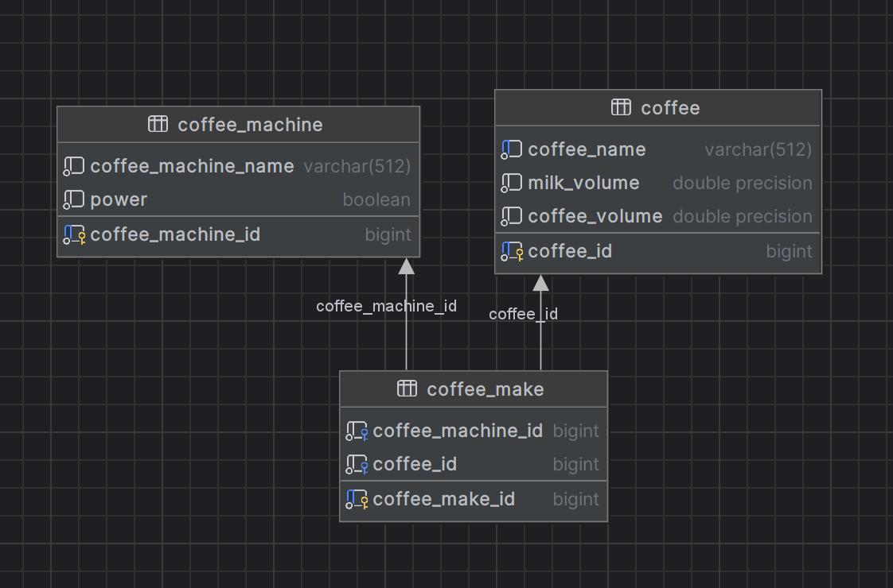

# Coffee make

**Программа предназначена для работы кофеварки и управлению через браузер.**

<u>***Возможности приложения:***</u>
- Создать тип кофе;
- Получить тип кофе по идентификатору;
- Получить все типы кофе с пагинацией;
- Найти тип кофе по названию с пагинацией;
- Создать кофемашину;
- Включить/выключить кофемашину;
- Создать кофейный напиток (для конкретной кофемашины свой тип кофе);

**Используемый стек: Java 11, Spring Boot, Spring Data JPA, Hibernate, Maven, PostgreSQL, Swagger**

<u>***Для запуска приложения необходимо:***</u>
- Склонировать репозиторий на ПК в необходимую папку;
- Создать БД со следующими свойствами:
  - HOST: localhost;
  - PORT: 5432;
  - user и password см. в 
[application.properties](
    https://github.com/mikhailovPI/CoffeeMaker/blob/main/src/main/resources/application.properties);
- Запустить файл 
[schema.sql](https://github.com/mikhailovPI/CoffeeMaker/blob/main/src/main/resources/schema.sql);
- Произвести запуск приложения (class ClaimRegistrarApplication);
- Запустить Postman на [localhost:8080](http://localhost:8080);
- Запустить коллекцию 
[тестов]()
в Postman;

***Схема базы данных:***
>
>
***Данные для тестирования в Postman:***
[tests]()

